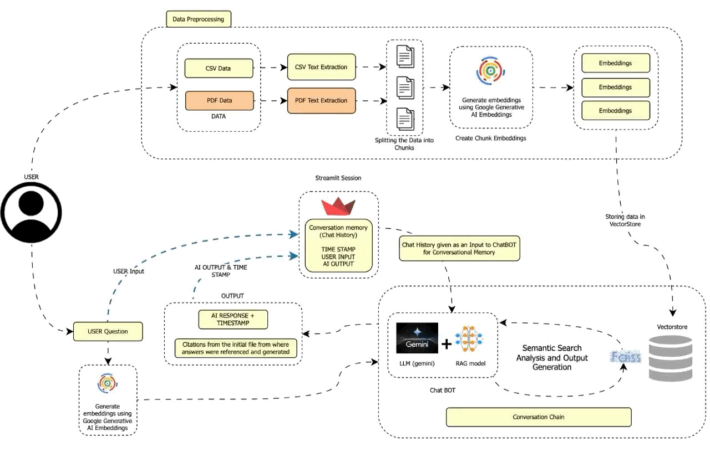

# EMA ASSIGNMENT AYON

This project is a Streamlit-based application that processes PDF and CSV files to extract text, create a vector store using Google's Generative AI embeddings, and allows users to ask questions from the processed documents. The app uses LangChain for text processing and conversational AI capabilities.

## Features

- Upload and process multiple PDF and CSV files.
- Extract text from uploaded files and split it into manageable chunks.
- Create a vector store using FAISS and Google Generative AI embeddings.
- Ask questions from the processed documents and get detailed answers with citations.
- View chat history and log details in the sidebar.

## Workflow

Here's a visual representation of the application's workflow:




## Setup Instructions

### Prerequisites

- Python 3.8 or higher
- A Google API key for accessing Google Generative AI services

### Installation

1. Clone this repository:
    ```sh
    https://github.com/AyonSOMADDAR/EMA_BOT.git
    cd EMA_BOT
    ```

2. Create a virtual environment and activate it:
    ```sh
    python3 -m venv venv
    source venv/bin/activate
    ```

3. Install the required packages:
    ```sh
    pip install -r requirements.txt
    ```

4. Set up environment variables:
    - Create a `.env` file in the root directory.
    - Add your Google API key to the `.env` file:
        ```env
        GOOGLE_API_KEY=your_google_api_key_here
        ```

### Running the Application

Start the Streamlit application:
    ```sh
    streamlit run ema.py
    ```
You will be redirected automatically to access the application.

## Usage

### Uploading Files

1. Use the sidebar menu to upload PDF or CSV files.
2. Click on the "Submit & Process" button to process the uploaded files.

### Asking Questions

1. Enter your question in the text input field at the top of the page.
2. The AI will process your question and provide a detailed answer with citations from the uploaded documents.

### Viewing Logs

Toggle the "View Logs" option in the sidebar to view the latest log entries.

## Logging

- Log files are saved in `app.log`.
- The log format includes timestamps, log levels, and messages.

## Dependencies

- Streamlit
- Pandas
- PyPDF2
- LangChain
- FAISS
- Google Generative AI

## Author
Ayon Somaddar

- Ayon Somaddar

